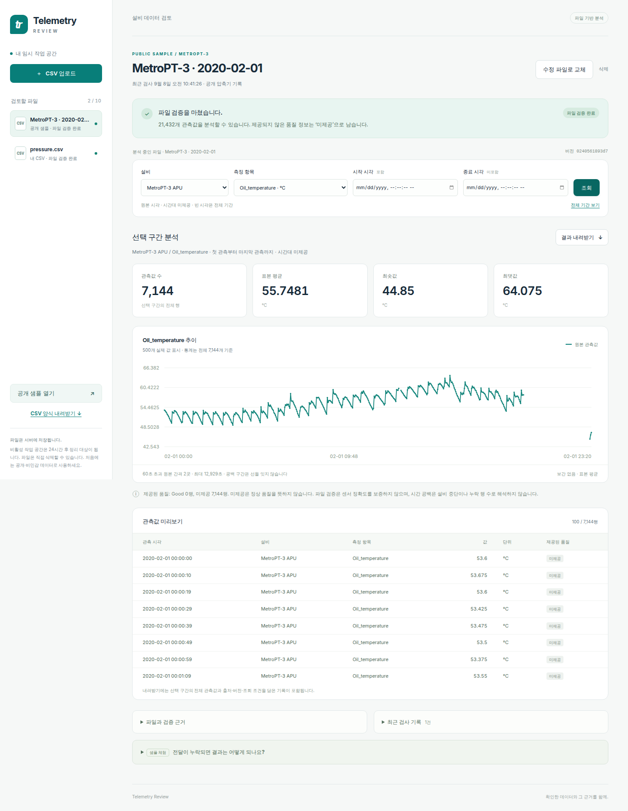

# Telemetry Review — 설비 CSV를 검토하고 분석 결과를 전달하는 도구

[](https://github.com/junhyun-dev/manufacturing-data-platform/actions/workflows/ci.yml)

설비 기록을 CSV로 받아 분석하는 데이터 엔지니어·분석가를 위한 작은 웹 도구입니다.
**파일 업로드 → 문제 확인 → 설비·측정 항목·시간 구간 조회 → 검토 근거와 함께 내려받기**를 제공합니다.
잘못된 수정 파일을 올리면 최신 검사 실패를 알리고 이전 정상 결과를 유지합니다.

현재는 실제 HTTP·Chromium·새 checkout·비루트 읽기 전용 컨테이너 재시작까지 확인한 **로컬 릴리스 후보**입니다.
외부 배포·실사용·production 성과는 검증하지 않았습니다. [파일 계약](docs/FILE_REVIEW_CONTRACT.md)과
[사용법·검증](docs/FILE_REVIEW_GUIDE.md)에서 입력 의미와 실행 범위를 확인할 수 있습니다.

```bash
make setup
make serve
# http://127.0.0.1:8000
```

브라우저에서 자기 CSV를 올리거나 **공개 샘플 열기**를 누르면 시작합니다. 소스 실행에는 Python 3.10+와 uv가
필요하며 MongoDB·클라우드 계정은 필요하지 않습니다. Docker의 `full` 모드는 자기 CSV를 받고,
`sample` 모드는 임의 업로드를 서버에서 차단합니다.

```bash
docker compose --env-file .env.example up --build
# http://127.0.0.1:8000
```

샘플에는 실제 MetroPT-3 기록 하루치 21,432개 관측이 들어 있습니다. 서비스는 중복·숫자·단위·시간대와
제공된 품질을 검사하고, `[시작, 종료)` 구간의 관측 수·표본 평균·최솟값·최댓값과 실제 관측을 보여줍니다.
품질 미제공을 Good으로 바꾸거나, 값을 보간하거나, 물리적 고장을 추정하지 않습니다. ZIP에는 선택한 전체
관측 CSV와 원본 hash·결과 version·조회 조건·품질 한계를 기록한 manifest가 들어갑니다.

파일은 실행 서버의 임시 작업 공간에 저장됩니다. 입력·보관·삭제 한도와 정확한 동작은
[파일 계약](docs/FILE_REVIEW_CONTRACT.md#state-identity-and-recovery)이 소유합니다.



## 무엇을 어디서 확인하는가

| 찾는 질문 | 현재 owner | 구현·증거 |
|---|---|---|
| 누구의 어떤 CSV 검토 업무이며 어떻게 사용하는가? | [사용과 실행](docs/FILE_REVIEW_GUIDE.md) | 위 실행 명령과 실제 브라우저 흐름 |
| 수용된 입력·시간·품질·state·HTTP·workspace 규칙은 무엇인가? | [File Review Contract](docs/FILE_REVIEW_CONTRACT.md) | [`model.py`](src/manufacturing_data_platform/file_review/model.py), [`store.py`](src/manufacturing_data_platform/file_review/store.py), [`app.py`](src/manufacturing_data_platform/file_review/app.py), [API tests](tests/test_file_review_api.py), [무결성 tests](tests/test_file_review_integrity.py) |
| browser·API·검증·저장·조회·export 책임은 어디에 있는가? | [Architecture](docs/ARCHITECTURE.md) | [`static/app.js`](src/manufacturing_data_platform/file_review/static/app.js), [`query.py`](src/manufacturing_data_platform/file_review/query.py), [`file_review/`](src/manufacturing_data_platform/file_review/) |
| 지금 진행 중인 한 작업과 다음 gate는 무엇인가? | [Project Status](PROJECT_STATUS.md) | 해당 revision·검증·외부 상태 |
| 닫힌 범위의 후속 작업과 완료 조건은 무엇인가? | [Backlog](docs/BACKLOG.md) | 기존 MFG 항목과 anchor |
| 파일 검토 업무·대안·사용자 검증 근거는 무엇인가? | [File review workflow research](docs/research/file-review-workflow.md) | 조사 근거이며 수용된 계약은 File Review Contract로 연결 |
| 검토 assistant의 benchmark·화면·설계안은 무엇인가? | [Review assistant research](docs/research/review-assistant.md) | **제안**이며 현재 제품 계약·구현이 아님 |
| 어떤 명령을 어느 환경·revision에서 확인했는가? | [Verification](docs/VERIFICATION.md) | test·HTTP·browser·container·OPC UA의 dated evidence와 한계 |
| 후보 release와 실제 공개 상태를 어떻게 구분하는가? | [Unreleased notes](CHANGELOG.md), Git commit·tag·Release | 후보 설명과 source revision은 배포 artifact·환경·runtime read-back을 대신하지 않음 |

## 검증·릴리스 경계

기본 검사는 `make test`, 파일 서비스 read-back은 `make verify-service`, container 경계는
`make verify-container`, 보존된 OPC UA laboratory는 `make verify`에서 확인합니다. 명령의 전제·생성물·최근 관측은
[Verification](docs/VERIFICATION.md)이 소유합니다. 위 badge는 해당 commit의 CI 실행 범위만 증명합니다.

[Changelog](CHANGELOG.md)의 `0.1.0`은 아직 공개되지 않은 후보입니다. Git tag·GitHub Release가 생겨도 실제 제공 여부는
실행 artifact의 revision·설정과 배포 환경의 read-back으로 별도 확인해야 합니다. 현재 gate는
[Project Status](PROJECT_STATUS.md)에서 확인합니다.

## 보존된 OPC UA 수집·발행 laboratory

이 저장소에는 현재 CSV 서비스와 계약·실행 경로가 다른 OPC UA 수집·발행 실험을 보존합니다. 일반 업로드를
OPC UA에서 수집한 데이터로 표시하지 않으며, 웹 서비스는 이 laboratory를 실행하지 않습니다.

```text
actual record      공개 MetroPT-3 historical value
local OPC UA       historical row를 DataValue로 재생한 local simulation
fault injection    Uncertain/Bad StatusCode와 collector 중단 시나리오
not production     실제 공장·physical PLC·production OPC UA·continuous Kafka 운영은 검증하지 않음
```

local replay는 실제 historical value를 사용하지만 live plant 연결은 아닙니다. 정상·품질 이상·collector 중단을
`PUBLISH / BLOCKED / REPROCESS REQUIRED`로 구분한 정확한 의미와 한계는 [OPC UA laboratory Contract](docs/CONTRACT.md),
component 책임은 [Architecture](docs/ARCHITECTURE.md#보존된-opc-ua-수집발행-laboratory), 실행 범위는
[Verification](docs/VERIFICATION.md)에서 확인합니다. 그보다 앞선 synthetic Kafka·Spark·Iceberg 경로는 현재 runtime이 아닌
[Historical Evidence](docs/HISTORICAL-EVIDENCE.md)입니다.

보존된 공개 결과는 [Industrial Telemetry Trust Report](docs/portfolio/industrial-telemetry-trust/README.md),
[정적 report](docs/portfolio/industrial-telemetry-trust/report.html),
[runtime evidence JSON](docs/portfolio/industrial-telemetry-trust/evidence/runtime-evidence.json),
[판정 화면](docs/portfolio/industrial-telemetry-trust/assets/01-operator-decisions.png)에서 읽을 수 있습니다.
[계약과 독립 검토 trace](docs/portfolio/industrial-telemetry-trust/README.md#계약과-독립-검토)는 당시 결과가 어떤
code·test·runtime evidence에 연결되는지 설명합니다. 이 frozen report는 현재 CSV 서비스의 배포·채택 증거가 아닙니다.

## 라이선스와 데이터 출처

이 저장소의 원본 소스 코드와 문서는 [Apache License 2.0](LICENSE)으로 공개합니다.
저장소에 포함된 MetroPT-3 발췌본과 파생 샘플에는 데이터 저자의 CC BY 4.0 조건이 유지됩니다.
[파일 검토 샘플 출처](src/manufacturing_data_platform/file_review/sample/README.md)와
[OPC UA fixture 출처](tests/fixtures/metropt3/README.md)에서 각각의 범위를 확인할 수 있습니다.
