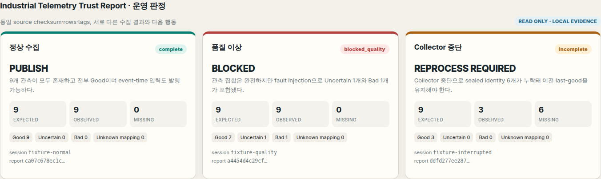
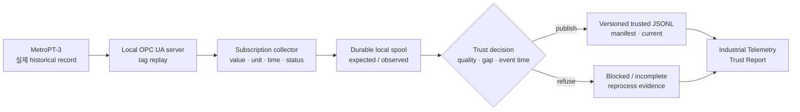

# Telemetry Review — 설비 CSV를 검토하고 분석 결과를 전달하는 도구

[](https://github.com/junhyun-dev/manufacturing-data-platform/actions/workflows/ci.yml)

설비 기록을 CSV로 받아 분석하는 데이터 엔지니어·분석가를 위한 작은 웹 도구입니다.
**파일 업로드 → 문제 확인 → 설비·측정 항목·시간 구간 조회 → 검토 근거와 함께 내려받기**를 제공합니다.
잘못된 수정 파일을 올리면 최신 검사 실패를 알리고 이전 정상 결과를 유지합니다.

```bash
make setup
make serve
# http://127.0.0.1:8000
```

Python 3.10+와 uv가 필요합니다. MongoDB·클라우드 계정 없이 실행되며, 브라우저에서 자기 CSV를 올리거나
**공개 샘플 열기**를 누르면 시작합니다. 샘플에는 실제 MetroPT-3 기록 하루치 21,432개 관측이 들어 있습니다.

- 설비·태그·시간의 중복, 숫자, 단위, 시간대와 제공된 품질을 검사합니다. 품질 미제공은 Good으로 바꾸지 않습니다.
- `[시작, 종료)`의 관측 수·표본 평균·최솟값·최댓값과 실제 관측 그래프를 제공합니다. 보간하거나 고장을 추정하지 않습니다.
- ZIP에는 선택한 전체 CSV와 원본 hash·결과 버전·조회 조건·품질 한계를 기록한 manifest가 들어갑니다.
- 수정 파일 교체와 재검사 이력을 남깁니다. 샘플에서 전달 누락 → 보관 원본 복구 → 같은 결과 버전도 체험할 수 있습니다.

현재는 **로컬 서비스 후보**입니다. 외부 배포·실사용·production 성과는 검증하지 않았습니다.
파일은 실행 서버의 임시 작업 공간에 저장됩니다. 8 MiB/50,000행, 작업 공간당 파일 10개이며 직접 삭제할 수 있습니다.
비활성 공간은 24시간 뒤 다음 세션 생성 또는 서버 시작 때 정리됩니다.

[사용법과 실행·검증](docs/FILE_REVIEW_GUIDE.md) · [파일 계약](docs/FILE_REVIEW_CONTRACT.md) ·
[현재 작업](PROJECT_STATUS.md) · [보완 backlog](docs/BACKLOG.md) · [구조](docs/ARCHITECTURE.md)


## 기존 OPC UA 수집·발행 검증

아래는 이 저장소의 기존 수집 실험과 보존된 공개 보고서입니다. 위 CSV 서비스와 계약·실행 경로가 다릅니다.
일반 업로드를 OPC UA에서 수집한 데이터로 표시하지 않으며, 웹 서비스는 이 실험의 실행을 요구하지 않습니다.

상정한 주 사용자는 설비 관측 데이터(telemetry)를 후속 분석·ML에 공개할 책임이 있는 제조 데이터 플랫폼
운영자입니다. 관측 누락, 품질 이상, 도착 지연, 수집기(collector) 중단이 섞이면 같은 원본 데이터 범위라도
그 결과를 그대로 발행해도 되는지 판단하기 어렵습니다.

이 프로젝트는 공개된 실제 설비 관측 기록을 로컬 OPC UA로 재생·수집해 값의 의미·시간·품질·완전성을 검증한 뒤
**`PUBLISH`(발행) · `BLOCKED`(차단) · `REPROCESS REQUIRED`(재처리)** 중 하나를 결정하는
로컬 환경에서 범위를 한정해 검증하는 데이터 플랫폼입니다. 분석가와 ML 엔지니어는 운영자가 공개한 trusted dataset의
소비자입니다.

```text
actual record      공개 MetroPT-3 historical value
replay simulation  local OPC UA server가 historical row를 DataValue로 재생
fault injection    quality 시나리오의 Uncertain/Bad StatusCode와 collector 중단
not verified       실제 공장 네트워크·physical plant·production OPC UA 운영
```

즉 센서값을 임의로 만든 데모는 아니지만, 실제 공장 네트워크나 현재 동작 중인 설비에
연결한 것도 아닙니다.

> 대표 결과: [Industrial Telemetry Trust Report](docs/portfolio/industrial-telemetry-trust/README.md) ·
> [정적 HTML](docs/portfolio/industrial-telemetry-trust/report.html) ·
> [runtime evidence JSON](docs/portfolio/industrial-telemetry-trust/evidence/runtime-evidence.json)
>
> 이 결과를 검증한 방식: [계약과 독립 검토](docs/portfolio/industrial-telemetry-trust/README.md#계약과-독립-검토)



개발을 이어갈 때는 [현재 작업과 다음 gate](PROJECT_STATUS.md)에서 시작합니다.
판정 의미는 [Contract](docs/CONTRACT.md), 보완 순서와 완료 조건은 [Backlog](docs/BACKLOG.md)가 소유합니다.
빠른 로컬 재현은 아래 `make setup`, `make test`, `make verify` 세 명령입니다.

제품으로 보강할 방향과 기존 대안 비교는 [사용자 업무·source 조사](docs/BACKLOG.md#mfg-08--product-value-and-source-reality)에
정리했습니다. 원본의 시간 공백, 독립 SQL 기준선, 분석 결과·복구·반복 사용의 검증 조건을 포함합니다.
현재 구현과 후속 제품 가설을 구분하며, 실제 사용자 수용은 아직 확인하지 않았습니다.

## 한눈에 보는 결과

같은 MetroPT-3 원본 데이터 범위를 정상·품질 이상·수집기 중단 상황으로 재현해 서로 다른 다음 행동을 확인합니다.

| 상황 | 관측 결과 | 판정 | 다음 행동 |
|---|---|---|---|
| 정상 수집 | expected 9 / observed 9 / Good 9 | `complete` | `PUBLISH` |
| 품질 이상 | expected 9 / observed 9 / Uncertain 1 / Bad 1 | `blocked_quality` | `BLOCKED` |
| collector 중단 | expected 9 / observed 3 / missing 6 | `incomplete` | `REPROCESS REQUIRED` |

같은 수집 결과의 중복·역순 입력은 허용 범위 안에서 정상 입력과 같은 dataset version으로 수렴합니다.
too-late·missing·quality failure는 기존 trusted current를 전진시키지 않습니다.
새로 수집하면 server/collection time이 달라져 새 version이 생길 수 있습니다. 재처리 실행과
원본 재수집의 멱등성은 [후속 계약 검토](docs/BACKLOG.md#mfg-02--recovery-and-replay-identity) 대상입니다.



## 어떤 데이터를 사용하는가

[UCI MetroPT-3](https://archive.ics.uci.edu/dataset/791/metropt%203%20dataset)는 지하철
공기압축기에서 수집된 압력·온도·전류·밸브 계열 기록입니다. 보존된 공개 보고서는 전체 배포 CSV의
1,516,948개 행과 SHA-256을 확인한 실행을 근거로 합니다. 이는 전체 행의 파이프라인 처리 실적이 아닙니다.
기본 로컬 재현에서는 저장소에 포함된 첫 3개 physical row의
다음 tag를 선택합니다.

- `TP2`: 압력, `bar`
- `Oil_temperature`: 오일 온도, `°C`
- `Motor_current`: 모터 전류, `A`

따라서 한 collection의 기대 관측 집합은 `3 rows × 3 tags = 9 observations`입니다.
OPC UA 검증은 CC BY 4.0 출처를 명시한 [3-row fixture](tests/fixtures/metropt3/README.md)를
사용합니다. 웹 서비스의 하루치 샘플은 별도이며, 전체 CSV는 커밋하지 않습니다.

## 수집 단계에서 보존하는 것

`industrial_telemetry_v1`은 다음 정보를 한 관측값의 계약으로 묶습니다.

- equipment ID, tag ID, OPC UA NodeId
- value와 engineering unit
- 원본 historical timestamp
- OPC UA source timestamp와 server timestamp
- collector가 기록한 collection time
- Good·Uncertain·Bad StatusCode
- mapping version과 source file identity
- actual record·replay·fault injection provenance

OPC UA subscription은 값이 같아도 timestamp가 바뀐 관측을 보존하도록
`StatusValueTimestamp` trigger를 사용합니다. 수집 완전성은 추정 cadence가 아니라 봉인된
expected event identity 집합과 실제 observed 집합을 비교해 판단합니다.

## 이벤트 시간과 trusted dataset

수집된 canonical telemetry에 별도 arrival envelope를 씌워 다음을 검증합니다.

| 입력 | Accepted | 핵심 evidence | 판정 |
|---|---:|---|---|
| in order | 9 | exact expected set | `publishable` |
| duplicate + out of order | 9 | duplicate 1, out of order 3 | `publishable` |
| too late | 6 | too late 3, missing 3 | `reprocess_required` |
| missing | 8 | missing 1 | `incomplete` |
| quality failure | 9 | Uncertain 1, Bad 1 | `blocked_quality` |

정상과 허용 범위 내 disorder는 같은 content-addressed dataset version으로 수렴합니다.
trusted 결과는 JSONL, manifest, `current_trusted.json`으로 구성되며 새 발행 전 기존
`current → manifest → data` digest chain을 다시 검증합니다. 기존 current가 손상되거나
symlink로 바뀌면 조용히 교체하지 않고 immutable integrity failure를 남깁니다.

로컬 Spark 3.5.8 file micro-batch에서도 watermark, deduplication, checkpoint restart 후
accepted event identity가 engine-independent 결과와 일치하는지 확인했습니다. 이 결과는
Kafka source나 Iceberg streaming sink를 검증한 것이 아닙니다.

## 실행

### 새 환경에서 현재 경로 재현

Python 3.10과 uv, Bash, Make가 있는 Linux 환경을 기준으로 합니다.

```bash
make setup
make test
make verify
```

`make setup`은 `requirements-dev.lock`의 base + OPC UA 의존성을 `.venv`에 설치합니다.
`make verify`는 실제 loopback OPC UA replay로 collection 3개·event-time 5개 시나리오를 실행하고,
`.cache/telemetry-runs/run-*`에 결과와 `runtime_identity.json`, `readback.json`을 남깁니다.
기존 결과를 덮어쓰지 않으며 원격 서비스·Docker·전체 CSV가 필요하지 않습니다.
출력된 `current → manifest → data`를 다시 읽어 digest까지 검증한 뒤 성공합니다.
설치·optional runtime·실패 시 확인 위치는 [Verification](docs/VERIFICATION.md)을 따릅니다.

### Base CI와 같은 테스트

```bash
python -m pip install -r requirements.txt -c requirements-dev.lock
PYTHONPATH=src python -m pytest -q
```

GitHub Actions badge는 해당 commit의 CI 실행 범위만 증명합니다. Workflow의 base job은
optional runtime을 제외하고, telemetry job은 OPC UA contract와 fixture read-back을 실행합니다.
Spark, Kafka, Iceberg, Airflow는 별도 환경에서 검증합니다. 아직 push하지 않은 변경의
원격 CI 상태는 [현재 작업](PROJECT_STATUS.md)에서 구분합니다.

### OPC UA source contract

```bash
make setup
PYTHON_BIN=.venv/bin/python ./scripts/verify_industrial_source_contract.sh
```

이 command는 공개 3-row fixture를 local OPC UA server에서 replay하고 normal·quality·
interrupted collection을 검증한 뒤 임시 output을 제거합니다.

### Event-time trust와 local Spark parity

```bash
uv venv --python 3.10 .cache/venvs/spark
uv pip install --python .cache/venvs/spark/bin/python \
  -r requirements-dev.lock -r requirements-event-time.txt
PYTHON_BIN=.cache/venvs/spark/bin/python ./scripts/verify_event_time_trust.sh
```

### Trust Report 재생성

아래는 **보존된 공개 보고서의 authoring 경로**입니다. 기본 `make verify`와 별개이며,
전체 MetroPT CSV와 Spark를 포함한 해당 실행 근거가 `.cache/`에 있어야 합니다.
그 파일이 없는 새 checkout에서는 [재현성 보완 항목](docs/BACKLOG.md#mfg-03--public-report-reproduction-without-the-authors-cache)을 따릅니다.

```bash
python3 scripts/build_industrial_trust_report.py \
  --baseline-commit 36e7344 \
  --verified-on 2026-07-31
python3 scripts/capture_industrial_trust_report.py
```

Builder는 source checksum·row count, collection report/spool/seal/last-good,
event-time report, trusted current/manifest/data를 교차 검증합니다. HTML은 committed
evidence JSON과 동일한 document를 embed하고 그 값만 렌더링합니다.

## 공개 evidence

| 확인하려는 것 | Evidence |
|---|---|
| 세 operator 판정과 화면 | [Trust Report walkthrough](docs/portfolio/industrial-telemetry-trust/README.md) |
| 실제 source·OPC UA replay·fault 구분 | [source provenance 화면](docs/portfolio/industrial-telemetry-trust/assets/02-source-provenance.png) |
| duplicate·late·missing·trusted current | [event-time 화면](docs/portfolio/industrial-telemetry-trust/assets/03-event-time-trust.png) |
| 화면이 읽는 authoritative 값 | [runtime-evidence.json](docs/portfolio/industrial-telemetry-trust/evidence/runtime-evidence.json) |
| 실행·검증 범위 | [Verification](docs/VERIFICATION.md) |

## Historical Evidence — 기존 v1

현재 제품의 Golden Flow는 위 industrial telemetry trust 경로입니다. 그 이전에는 synthetic
machine event를 대상으로 다음 복구 원리를 검증했습니다.

```text
sealed edge spool
→ local Kafka landing
→ complete + exact-set recovery gate
→ Spark quality
→ local Iceberg publish
```

부분 복구는 Spark/Iceberg state를 만들기 전에 거부되고, 같은 source 재실행은 새 snapshot을
만들지 않습니다. 이 경로는 현재 제품에 연결된 Extension이 아니라 검증된
[Historical Evidence](docs/HISTORICAL-EVIDENCE.md)입니다. 새로운 continuous pipeline 요구가
생기면 현재 telemetry contract에서 다시 설계하며, 두 경로가 연결돼 있다고 주장하지 않습니다.

## 검증 범위와 한계

이 프로젝트에서 확인한 것:

- 실제 공개 산업 기록의 checksum을 검증하고 local OPC UA subscription으로 replay했다.
- tag·단위·source/server/collection time·quality·mapping·source identity를 보존했다.
- 정상·품질 이상·collector 중단의 expected/observed coverage와 operator action을 구분했다.
- duplicate·out-of-order·too-late·missing·quality failure를 local bounded 정책으로 판정했다.
- local Spark file micro-batch의 watermark/dedup/checkpoint identity parity를 확인했다.
- content-addressed 로컬 trusted dataset과, 손상된 current를 교체하지 않는 무결성 보호를 구현했다.

아직 검증하지 않은 것:

- physical PLC·sensor·실제 plant network 또는 production OPC UA 운영 경험
- continuous Kafka→Spark→Iceberg telemetry streaming
- production lateness SLA, HA, throughput, cluster Spark correctness
- multi-partition Kafka rebalance, distributed transaction, end-to-end exactly-once
- 자동 historical correction, 실제 control-plane action 또는 AI model 결과

이 저장소는 개인 포트폴리오이며 회사 코드·고객 데이터·내부 schema를 포함하지 않습니다.

## 더 보기

- [현재 Architecture와 Golden Flow](docs/ARCHITECTURE.md)
- [판정·identity·time 계약](docs/CONTRACT.md)
- [보완할 결과와 완료 조건](docs/BACKLOG.md)
- [검증 환경·명령·검증 범위와 한계](docs/VERIFICATION.md)
- [기존 v1 Historical Evidence](docs/HISTORICAL-EVIDENCE.md)
