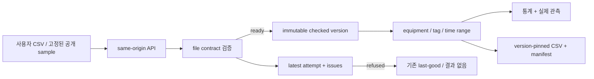
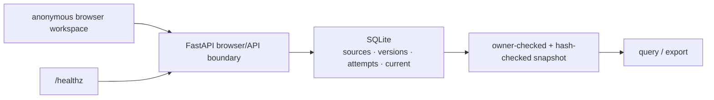
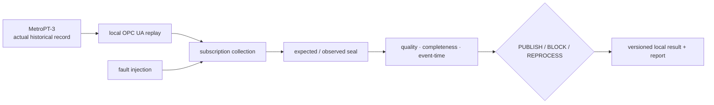

# Architecture — Telemetry Review와 보존된 수집 laboratory

## 현재 제품: CSV file review service

### 사용자 journey

사용자는 [브라우저 client](../src/manufacturing_data_platform/file_review/static/index.html)에서 파일을 올리거나
공개 sample을 열고, 검사 결과를 확인한 뒤 한 설비·측정 항목·시간 구간을 조회해 근거 ZIP을 내려받습니다.
입력·시간·품질·state·HTTP 의미와 한도는 [File Review Contract](FILE_REVIEW_CONTRACT.md)가 소유합니다.
[사용과 실행](FILE_REVIEW_GUIDE.md)은 이 journey와 실패 복구 방법을 독자에게 설명합니다.

### 책임 지도

| 경계 | 구현 owner | 책임과 연결된 evidence |
|---|---|---|
| browser 화면과 현재 선택 | [`static/index.html`](../src/manufacturing_data_platform/file_review/static/index.html), [`static/app.js`](../src/manufacturing_data_platform/file_review/static/app.js) | dataset·latest/current 표시, version을 고정한 조회·download, 이전 결과와 오류 표시 |
| HTTP·browser security boundary | [`app.py`](../src/manufacturing_data_platform/file_review/app.py) | static client와 same-origin route, workspace cookie·CSRF·origin/host 확인, mode별 upload 허용, health identity |
| CSV 검증과 content identity | [`model.py`](../src/manufacturing_data_platform/file_review/model.py) | CSV normalization, timestamp·quality·unit·duplicate 판정, source/version에 들어갈 canonical payload |
| workspace state와 last-good | [`store.py`](../src/manufacturing_data_platform/file_review/store.py) | workspace 소유권, SQLite transaction, source/version/attempt/current, integrity read-back, retention·삭제 |
| 조회와 전달 artifact | [`query.py`](../src/manufacturing_data_platform/file_review/query.py) | integrity-checked snapshot의 SQL 집계·실제 point 선택, 전체 선택 CSV와 manifest export |
| 선택 질문의 결과 설명 | [`explanation.py`](../src/manufacturing_data_platform/file_review/explanation.py), [`app.py`](../src/manufacturing_data_platform/file_review/app.py), [`static/app.js`](../src/manufacturing_data_platform/file_review/static/app.js) | 마지막 조회의 version·latest attempt 고정, 같은 snapshot/query의 사실로 규칙 기반 설명, 맥락 변화·취소·실패 시 답변 무효화 |
| 계약·실패 반례 | [API tests](../tests/test_file_review_api.py), [integrity tests](../tests/test_file_review_integrity.py) | 정상/거부/교체, cross-workspace 접근, 변조·transaction 실패, version-pinned export |
| 실제 실행 read-back | [HTTP verifier](../scripts/verify_file_review.py), [browser verifier](../scripts/verify_file_review_browser.py), [container verifier](../scripts/verify_release_container.py) | API·화면·container에서 관측한 결과; exact 실행 범위는 [Verification](VERIFICATION.md) 소유 |

이 표는 책임 위치를 찾는 지도입니다. 필드·status·route·수치 한도를 복제하지 않으며, 그 의미를 바꿀 때는
File Review Contract와 영향받는 server/client/test를 함께 검토합니다.

### state와 신뢰 경계

- dataset id만으로 다른 workspace의 파일을 읽을 수 없습니다. mutation은 workspace cookie와 CSRF를 요구하고,
  모든 dataset read/write는 server에서 소유권을 다시 확인합니다.
- 원본 bytes와 normalized version은 immutable identity로 보관하고 읽을 때 hash와 연결을 재검증합니다.
  손상된 current는 분석·export에서 거부하지만 해당 dataset 관리와 다른 정상 dataset 접근은 유지합니다.
- latest attempt와 current version은 별도 상태입니다. ready 결과만 current를 전진시키므로 잘못된 교체·불완전 전달·
  transaction 실패는 last-good을 바꾸지 않습니다. 기존 current가 없으면 조회할 결과도 없습니다.
  화면과 export는 사용한 version과 이전 결과 여부를 드러냅니다.
- client는 CSV 전체를 자체 판정하지 않습니다. server의 검증·snapshot·집계 결과를 표시하며, export도 같은
  server-side version과 query를 사용합니다.

결과 설명도 이 snapshot/query 경계를 재사용합니다. 새 query 응답의 latest attempt ID와 명시적 version으로
설명 대상을 고정하고, 다음 요청에서 최근 검사가 달라지면 답변을 거부합니다. 설명용 별도 데이터 저장소·SQL·LLM은 없습니다.
첫 preview의 선택 질문·응답·UI lifecycle은 [File Review Contract](FILE_REVIEW_CONTRACT.md#guided-result-explanation--first-local-preview),
후속 자유 대화·외부 공급자 설계 후보는 [조사 근거](research/review-assistant.md)가 소유합니다.

### runtime 경계

기본 entrypoint는 한 [FastAPI process](../src/manufacturing_data_platform/file_review/app.py)와 한 SQLite file입니다.
[Dockerfile](../Dockerfile)은 고정된 runtime dependency, non-root user와 health check를 구성합니다.
[Compose](../docker-compose.yml)는 Telemetry Review를 기본 service로 실행하며 read-only root filesystem,
writable SQLite data volume과 크기를 제한한 임시 공간을 설정합니다. 과거 MongoDB는 `historical` profile에서만 엽니다.

이 repository가 검증한 runtime은 단일 process·단일 database의 로컬 release candidate입니다. 공개 host의 TLS,
request 제한, monitoring, backup이나 multi-replica coordination은 구현된 현재 Architecture로 간주하지 않습니다.
후보 설정과 실제 검증 상태는 [Project Status](../PROJECT_STATUS.md)와 [Verification](VERIFICATION.md)을 구분해 읽습니다.

## 보존된 OPC UA 수집·발행 laboratory

아래 경로는 실제 MetroPT-3 historical record를 local OPC UA로 replay해 수집·발행 판단을 시험한 보존 evidence입니다.
현재 CSV service와 계약·storage·runtime이 다르며, `file_review` application에 mount되거나 일반 upload에 provenance를
부여하지 않습니다.

### laboratory 흐름

실제인 것은 공개 historical value입니다. OPC UA server와 collector는 local replay이고,
Uncertain·Bad StatusCode와 collector 중단은 fault injection입니다. physical PLC·실제 공장 network·production OPC UA
운영이나 현재 CSV 사용자의 live ingestion은 이 evidence로 검증하지 않았습니다.

### laboratory 책임과 근거

| 책임 | 구현 owner | 출력·판정 |
|---|---|---|
| observation 의미·identity | [`industrial_source/contracts.py`](../src/manufacturing_data_platform/industrial_source/contracts.py) | equipment/tag/value/time/status/provenance를 가진 canonical observation |
| actual record와 replay | [`industrial_source/source.py`](../src/manufacturing_data_platform/industrial_source/source.py), [`opcua_runtime.py`](../src/manufacturing_data_platform/industrial_source/opcua_runtime.py) | checksum-checked fixture와 local subscription value |
| collection·봉인 | [`industrial_source/spool.py`](../src/manufacturing_data_platform/industrial_source/spool.py) | expected/observed identity, immutable spool과 seal |
| source 판정 | [`industrial_source/verification.py`](../src/manufacturing_data_platform/industrial_source/verification.py), [`report.py`](../src/manufacturing_data_platform/industrial_source/report.py) | complete / blocked_quality / incomplete |
| event-time 판정 | [`event_time_trust/core.py`](../src/manufacturing_data_platform/event_time_trust/core.py) | accepted/rejected identity와 publishable/reprocess evidence |
| 공개 결과 build | [`build_industrial_trust_report.py`](../scripts/build_industrial_trust_report.py) | committed evidence를 대조한 static report·JSON·screens |

정확한 identity·시간·판정·single-writer 한계는 [OPC UA laboratory Contract](CONTRACT.md)가 소유합니다.
실행과 read-back은 [Verification](VERIFICATION.md), 보존된 결과와 review trace는
[Industrial Telemetry Trust Report](portfolio/industrial-telemetry-trust/README.md)가 소유합니다.
그보다 앞선 synthetic Kafka·Spark·Iceberg 실험은 현재 runtime 연결이 아닌
[Historical Evidence](HISTORICAL-EVIDENCE.md)로 분류합니다.
