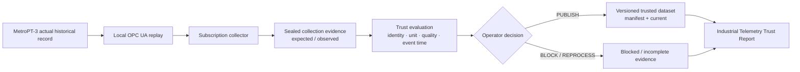

# Architecture — Industrial Telemetry Trust

## 한 문장

> 제조 데이터 플랫폼 운영자가 telemetry 수집 결과의 완전성·품질·시간·출처를 검증하고,
> downstream 분석·ML에 `PUBLISH / BLOCK / REPROCESS`할지 결정한다.

이 문서는 현재 제품의 Golden Flow와 component 책임만 설명한다. 과거 synthetic
catalog/lakehouse/Kafka/Spark 경로는 [Historical Evidence](HISTORICAL-EVIDENCE.md)이며 현재
runtime 흐름으로 연결됐다고 주장하지 않는다.

## Golden Flow



여기서 실제인 것은 MetroPT-3 historical value다. OPC UA server와 collector는 local replay이며,
Uncertain·Bad StatusCode와 collector 중단은 fault injection이다.

## Component Map

| 책임 | 현재 component | 입력 | 출력·상태 |
|---|---|---|---|
| observation 계약 | `industrial_source/contracts.py` | equipment/tag/value/time/status/provenance | canonical telemetry observation |
| actual record replay | `industrial_source/source.py`, `opcua_runtime.py` | MetroPT-3 fixture와 tag mapping | local OPC UA subscription value |
| collection·봉인 | `industrial_source/spool.py` | expected identity와 observed value | immutable spool, seal, coverage |
| source 판정 | `industrial_source/verification.py`, `report.py` | coverage·quality·mapping | complete / blocked_quality / incomplete |
| event-time 판정 | `event_time_trust/core.py` | canonical telemetry + arrival envelope | accepted set, duplicate/late/gap evidence |
| engine parity | `event_time_trust/spark_parity.py` | 동일한 bounded input | local Spark identity parity evidence |
| visible result | `scripts/build_industrial_trust_report.py` | accepted runtime evidence | static report, JSON, screenshots |

## 핵심 상태

```text
source record
  → collection open
  → collection sealed
  → complete / blocked_quality / incomplete
  → publishable / reprocess_required
  → versioned dataset + current  OR  blocked evidence
```

- `expected`와 `observed` identity 집합이 같지 않으면 complete로 만들지 않는다.
- Uncertain·Bad observation이 있으면 row 수가 맞아도 publish하지 않는다.
- duplicate·out-of-order는 정책 안에서 수렴시킬 수 있지만 too-late·missing은 reprocess 또는
  incomplete로 남긴다.
- 새 trusted version을 만들기 전에 기존 `current → manifest → data` digest chain을 검증한다.
- 실패한 시도는 last-good current를 전진시키지 않는다.

## 경계와 실패 책임

| 경계 | 조용히 성공시키지 않는 실패 | 보존하는 evidence |
|---|---|---|
| record → replay | source checksum·row·mapping 불일치 | source identity와 provenance |
| replay → collector | missing value, bad status, collector interruption | source/server/collection time, status |
| collector → seal | expected identity 미관측, duplicate conflict | expected/observed/missing set |
| seal → trust | too-late, gap, quality failure | accepted/rejected identity와 reason |
| trust → current | 기존 current 손상, 동일 content 재실행 | manifest/data digest, reused version |
| evidence → report | source/evidence hash 불일치 | build refusal; 임의 재계산 금지 |

## 가장 짧은 진입점

```bash
# base·contract tests
python -m pip install -r requirements.txt
PYTHONPATH=src python -m pytest -q

# local OPC UA replay와 normal/quality/interrupted 비교
python -m venv .venv
.venv/bin/python -m pip install -r requirements.txt -r requirements-opcua.txt
PYTHON_BIN=.venv/bin/python ./scripts/verify_industrial_source_contract.sh

# event-time trust와 local Spark parity
.venv/bin/python -m pip install -r requirements-event-time.txt
./scripts/verify_event_time_trust.sh
```

실행 환경과 claim 경계는 [Verification](VERIFICATION.md)을 따른다.

## 확장 규칙

다음 기능은 기술 이름이 아니라 같은 사용자와 같은 판정 흐름을 강화할 때만 이 프로젝트에 붙인다.

```text
같은 운영자가 telemetry publish/block/reprocess를 더 정확히 결정한다
  → 같은 프로젝트의 후보 Slice

다른 사용자·다른 업무 결정·다른 실패 owner가 중심이다
  → 별도 프로젝트 검토

Kafka·Flink·Iceberg·ML이라는 기술 이름만 추가된다
  → 활성화하지 않음
```
