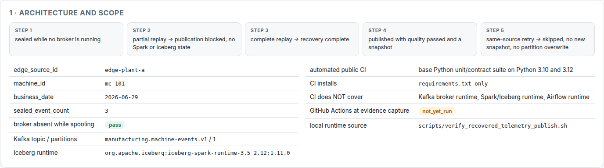
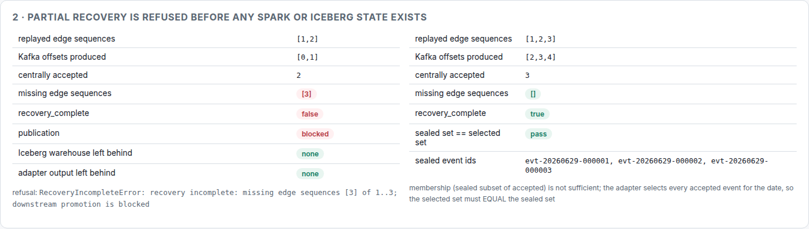
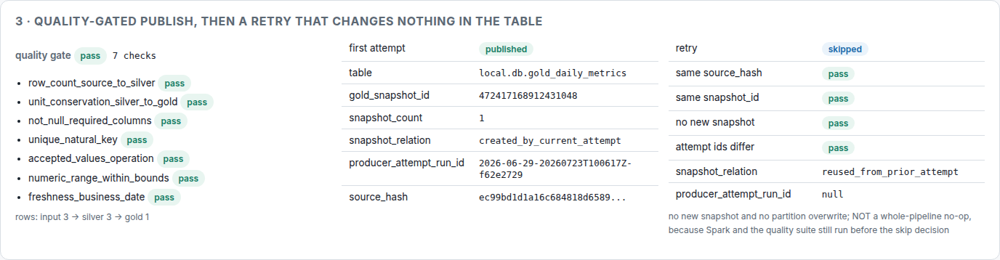

# Platform Overview — 복구된 edge 세션은 "완결이 증명될 때만" gold table에 도달한다

> English: [`README.md`](README.md)
> Runtime evidence: [`evidence/runtime-evidence.json`](evidence/runtime-evidence.json) · 렌더링: [`report.html`](report.html)
> 이 evidence의 source commit: `d8ec816`

이 문서가 플랫폼 전체의 대표 walkthrough다. Kafka ingestion milestone
([`../kafka-k1-k1-5/README.ko.md`](../kafka-k1-k1-5/README.ko.md))은 입력 경로에 대한 supporting
deep dive로 그대로 남아 있고, 리뷰어가 먼저 읽어야 할 end-to-end 경로는 이 문서다.

## 1. 문제

현장 링크가 끊긴다. 수집은 멈출 수 없으니 event는 edge에 쌓인다. 링크가 돌아오면 전부 replay되는데,
이때 가장 하기 쉬운 선택이 "데이터가 다시 들어오기 시작했으니 batch를 돌린다"이다.

그리고 그게 정확히 **아무도 방어할 수 없는 숫자**를 만든다.

```text
단절 구간의 일부가 아직 안 왔는데 gold table이 먼저 전진하고,
그 뒤에는 그게 유실인지 애초에 없었던 건지 아무도 말할 수 없다.
```

그래서 진짜 질문은 "어떻게 버퍼링하고 replay하느냐"가 아니다.

```text
복구된 구간이 trusted table을 바꿔도 된다고 말하려면, 그 전에 무엇이 참이어야 하는가?
```

## 2. 실패 시나리오

```text
broker 없는 상태에서 edge sequence 1,2,3을 spool하고 seal
-> 링크 복구, 1,2만 Kafka로 replay              (offset [0,1])
-> 발행 거부: sequence 3이 없다
-> 3 replay                                      (offset [2,3,4])
-> 복구 완결
-> Spark quality suite 통과
-> Iceberg business_date partition 1개 발행
-> 같은 source 재실행: 새 snapshot 없음, partition overwrite 없음
```

## 3. state / identity 계약

설계 전체를 떠받치는 계약은 셋이다.

**durability가 progress보다 먼저.** Kafka offset은 record가 durable하게 landing된 **뒤에만**
commit한다. 그 사이에 죽으면 재전달이 발생할 뿐, record가 사라지지 않는다.

**복구가 발행보다 먼저.** Spark가 시작되기 전에 서로 다른 두 조건이 모두 성립해야 한다.

```text
완결성      봉인된 모든 event_id가 중앙 accepted 집합에 존재한다
정확한 입력  선택된 batch event 집합이 봉인 집합을 "포함"하는 게 아니라 "같다"
```

두 번째가 미묘한 쪽이다. adapter는 그 `business_date`의 accepted event를 **전부** 고르므로, 같은
날짜에 다른 경로로 들어온 event가 하나만 있어도 "완결"이면서 더 이상 복구한 세션이 아닌 batch가
나온다. membership만으로는 이 상태가 안 보인다.

**quality와 current-state 안전성.** quality를 통과한 데이터만 Iceberg table을 전진시키고, 같은
source 재실행은 새 snapshot을 만들지 않고 partition overwrite도 하지 않는다.

identity space 다섯 개는 각각 자기 field에 따로 기록된다.

| Space | 이번 실행의 값 | 무엇에 답하는가 |
|---|---|---|
| edge sequence | `[1, 2, 3]` | edge가 어떤 순서로 기록했는가 |
| business `event_id` | `evt-20260629-000001…3` | 같은 business event인가 |
| Kafka coordinate | offset `[0, 1, 4]` | 이번 전송에서 transport가 어디에 뒀는가 |
| batch `source_hash` | `ec99bd1d1a16c684818d…` | 같은 batch 입력인가 |
| attempt `run_id` / `snapshot_id` | `…T100617Z-f62e2729` / `472417168912431048` | 어느 실행인가 / 어느 table commit인가 |

같은 event 3개인데 edge sequence는 `[1,2,3]`, Kafka offset은 `[0,1,4]`다. 완결성을 `event_id`
집합으로 판정하고 offset 연속성으로는 **절대** 판정하지 않는 직접적인 runtime 근거다.

## 4. 구현 경로

```text
edge spool  fsync + atomic rename. immutable 파일 집합 자체가 progress다
seal        expected_last_sequence가 "아직 안 옴"과 "유실"을 가른다
landing     durable JSONL landing 후에 offset commit
gate        승격 경로와 발행 경로가 함께 호출하는 readiness 함수 하나
adapter     기존 결정적 canonical CSV + SHA-256 source_hash (변경 없음)
동등성       봉인 event_id 집합 == 선택된 event_id 집합, Spark 시작 전에 검사
publish     기존 Spark silver/gold + quality suite + Iceberg partition overwrite (변경 없음)
evidence    5개 identity space와 snapshot 관계를 한 문서에 묶는다
```

발행 slice는 transform·quality·adapter·Kafka·Iceberg 로직을 **하나도 새로 쓰지 않는다.** 이미
검증된 두 계약을 조합하고, 첫 번째가 성립하기 전에는 두 번째가 시작되지 못하게 막을 뿐이다.

## 5. 잡아낸 반례

전부 먼저 실패하는 케이스로 작성했고, 리뷰어가 물어볼 만한 시나리오들이다.

```text
부분 복구                     거부. warehouse도 adapter 산출물도 남지 않음
같은 날짜의 세션 밖 event      복구가 완결이어도 extra_event_ids로 거부
봉인 event가 선택에서 빠짐      missing_event_ids로 거부
요청 날짜 != 봉인 세션 날짜     산출물이 생기기 전에 거부
quality 실패                  snapshot 없음, success-state 전진 없음
반복 replay                   transport 증거는 늘지만 accepted 집합과 source_hash는 불변
skipped 재실행                 만들지 않은 snapshot을 "재사용"으로 기록
```

이 중 둘은 첫 구현이 아니라 리뷰에서 나왔고, 둘 다 **동작이 아니라 기록**의 문제였다. skipped
재실행이 새로 발급된 attempt id를 재사용 snapshot 옆에 두어 "이 실행이 만들었다"로 읽히게 한 것,
그리고 quality 실패를 "존재하지 않는 snapshot을 재사용했다"로 분류한 것. 지금은 명시적이다 —
`snapshot_relation ∈ {created_by_current_attempt, reused_from_prior_attempt, no_snapshot}`이고,
만든 실행을 정말 모를 때 `producer_attempt_run_id`는 `null`로 남긴다.

## 6. Runtime evidence

전체 경로 재현:

```bash
PYTHON_BIN=python ./scripts/verify_recovered_telemetry_publish.sh
```

`d8ec816`에서 관측된 값 (전체는
[`evidence/runtime-evidence.json`](evidence/runtime-evidence.json)):

| 단계 | 관측값 |
|---|---|
| spool | 3 event 봉인, `broker_absent_during_spool = true` |
| 부분 replay | accepted 2, missing `[3]`, 발행 차단, warehouse 없음, adapter 없음 |
| 완결 replay | accepted 3, missing `[]`, `recovery_complete = true` |
| 정확한 입력 | 봉인 event id 3개 == 선택 event id 3개 |
| quality | 7/7 통과, rows 3 → 3 → 1 |
| 첫 발행 | `published`, snapshot `472417168912431048`, `created_by_current_attempt` |
| 재실행 | `skipped`, 같은 `source_hash`, 같은 snapshot, `snapshot_count` 불변 |







이 화면들은 committed JSON을 렌더링하는 [`report.html`](report.html)의 브라우저 캡처다. 손으로 적은
숫자가 아니다. 각 runbook의 실행 이력은
[`../../../VERIFICATION_LOG.md`](../../../VERIFICATION_LOG.md)에 있다.

### 자동 검증과 문서화된 로컬 검증의 경계

| | 커버하는 것 | 커버하지 않는 것 |
|---|---|---|
| Public CI ([`ci.yml`](../../../.github/workflows/ci.yml)) | base Python unit/contract suite, Python 3.10·3.12, `requirements.txt`만 설치 | Kafka · Spark/Iceberg · Airflow runtime |
| 로컬 runbook ([`scripts/`](../../../scripts/)) | 실제 local broker, Spark/Iceberg, Airflow `dags test` | 분산·production에 해당하는 모든 것 |

CI badge는 base suite를 증명한다. 무거운 runtime은 증명하지 않고, 이 문서도 그렇게 쓰지 않는다.

## 7. 한계

```text
synthetic 데이터. session 1개 · machine 1개 · business_date 1개 · topic partition 1개 · gold table 1개
single writer. concurrent Iceberg writer는 다루지 않는다
로컬 filesystem durability 경계 — power-loss · NFS · object store 보장 없음
gate → Spark → Iceberg commit 사이의 분산 원자성 없음. 재실행이 수렴시킬 뿐 transaction이 아니다
Airflow, 이 S9 DAG 경로: DagBag / `dags test` 배선 검증까지만
Airflow, 앞선 Spark/Iceberg skeleton: local `standalone` scheduler / LocalExecutor 증거는 있음
둘 다 production Airflow는 아니다 — HA도, 분산 executor도, 배포된 scheduler도 아님
실제 OT/ROS2/MCAP/edge 하드웨어 입력 없음. edge는 로컬 spool로 모사한 것이다
streaming 아님. Kafka→Iceberg sink가 아니라 bounded batch 발행이다
runtime MongoDB는 이 환경에서 아직 미검증. Mongo 경로는 mongomock으로 커버된다
```

재실행이 "안전하다"는 건 **발행된 table이 바뀌지 않는다**는 뜻이다. 전체 파이프라인 no-op이
아니다 — S7은 skip으로 판정하기 전에 Spark를 띄우고 quality suite를 돌린다.

## 8. 3분 면접 설명

> 이 프로젝트에서 흥미로운 부분은 데이터를 옮긴다는 게 아니라 **옮기기를 거부한다**는 쪽입니다.
>
> 현장 링크가 끊기면 event가 edge에 쌓이고 복구되면 replay됩니다. 순진한 파이프라인은 데이터가
> 다시 보이자마자 batch를 돌리고, 구간 일부가 아직 오는 중인데 일일 지표가 조용히 움직입니다.
> 그걸 막으려고 단절 세션마다 expected last sequence로 봉인을 걸었습니다. 이 봉인이 "아직 안 옴"과
> "유실"을 구분해 주는 유일한 근거입니다. 봉인이 없으면 그 구분 자체가 불가능합니다.
>
> 완결성은 business `event_id` 집합으로 판정하고 Kafka offset 연속성으로는 판정하지 않습니다.
> 실제 실행에서 edge sequence 1~3이 offset 0, 1, 4에 앉았습니다. replay하면 같은 event가 새 offset에
> 가기 때문입니다. 서로 다른 identity space이고, 섞으면 오탐과 잘못된 확신이 동시에 생깁니다.
>
> 그런데 완결성만으로는 부족했습니다. batch adapter는 그 날짜의 accepted event를 전부 고르기
> 때문에, 같은 날짜에 다른 경로로 들어온 event가 하나만 있어도 완결성 검사는 통과하면서 제가 봉인한
> 세션이 아닌 batch가 됩니다. 그래서 gate는 Spark 시작 전에 집합 동등성까지 요구하고, 이 gate가
> Spark import보다 앞에 있어서 부분 복구는 warehouse도 adapter 산출물도 남기지 않습니다.
>
> 그 뒤로는 기존 quality suite와 Iceberg partition overwrite를 그대로 재사용하고, 같은 source
> 재실행은 새 snapshot을 만들지 않습니다. 한 가지 덧붙이면, 엔진이 skip된 재실행에도 새 run id를
> 발급하기 때문에 evidence에는 snapshot을 **재사용**으로 적고 만든 실행은 모른다고 남깁니다.
> 재실행이 만든 것처럼 읽히면 안 되니까요.
>
> 경계는 의도적입니다. synthetic 데이터, 세션 1개, partition 1개, 로컬 table 1개입니다. public
> CI는 base unit/contract suite를 돌리고 Kafka·Spark·Airflow 증거는 문서화된 로컬 runbook에서
> 나옵니다.

## 9. 어떻게 만들었나

AI는 질문 발굴과 후보 구현을 가속했다. 수용에는 명시적 계약, 반례, runtime state evidence,
독립 리뷰가 필요했고, `accepted-closed` 전에 여러 건의 거짓 evidence 주장이 반려됐다.

구체적으로는, skipped 재실행이 재사용한 snapshot을 자기가 만든 것처럼 보이게 한 기록, 지키려던
반례가 사라져도 통과할 수 있는 검증 조건, 그리고 Spark와 quality suite를 여전히 실행하는 경로를
"재실행은 no-op"이라고 서술한 문장이 반려됐다. 세 경우 모두 **동작은 옳았고 기록이 틀렸다.**
리뷰 gate는 정확히 그걸 잡으라고 있는 것이다.

## 상세 링크

- 결정: [`../../../learn/reference-decisions/recovery-gated-publish-boundary.md`](../../../learn/reference-decisions/recovery-gated-publish-boundary.md)
- Slice map: [`../../../learn/system-design/slices/09-recovery-gated-spark-iceberg.ko.md`](../../../learn/system-design/slices/09-recovery-gated-spark-iceberg.ko.md)
- 전체 추적 지도: [`../../../learn/system-design/01-system-traceability-map.ko.md`](../../../learn/system-design/01-system-traceability-map.ko.md)
- 코드: [`../../../src/manufacturing_data_platform/pipeline/recovered_telemetry_publish.py`](../../../src/manufacturing_data_platform/pipeline/recovered_telemetry_publish.py)
- 테스트: [`../../../tests/test_recovered_telemetry_publish.py`](../../../tests/test_recovered_telemetry_publish.py)
- Runbook: [`../../../scripts/verify_recovered_telemetry_publish.sh`](../../../scripts/verify_recovered_telemetry_publish.sh)
- 검증 이력: [`../../../VERIFICATION_LOG.md`](../../../VERIFICATION_LOG.md)
